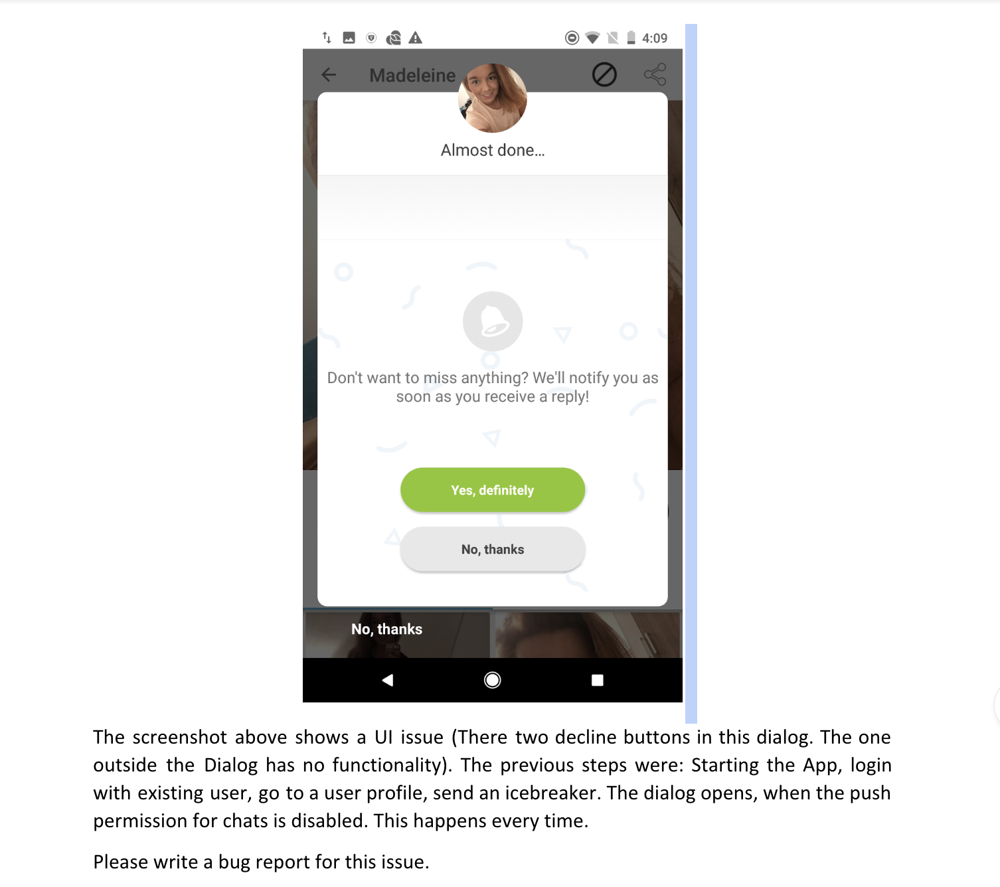

# BugReport
Scenario and Bug Reports

## Bug Report :
- **Bug Number**: 1
- **Bug Title**: Two “No Thanks”  button is displayed on chat dialog Window.
- **Priority**: Need to decide during bug Triage
- **Severity**: Major
- **Environment**: QA
- **Reporter**: Trisha
- **Assign**: Developer
- **Date**: 7th Nov 2018
- **Sprint**: 1
- **Build No**: 1
- **Platform**: Mobile
- **OS**: Android/iOS (Including actual Version number)
- **Browser**: N/A
- **Note**: This happens every time and it's not an intermittent issue
- **Prerequisite**: Charged Mobile with APK/IPA file.
- **Steps to Reproduce**:
   1. Launch the App
   2. Login with existing user
   3. Navigate to a user profile
   4. Send an icebreaker.
   5. The dialog opens, when the push permission for chats is disabled. 
   6. Verify Two No Thanks button is displayed 
   7. No Thanks button outside Dialog is not working
 - **Actual Result**: Two “No Thanks”  button is displayed on chat dialog Window and when the user is clicking on “No Thanks”    present outside the dialog window is not functional or clickable.
 - **Expected Result**:  Only one “No Thanks”  button should be displayed on chat dialog Window and the user should be able to click on it and land appropriate page

- **Screenshot** : The screenshot is **mentioned on Top**

